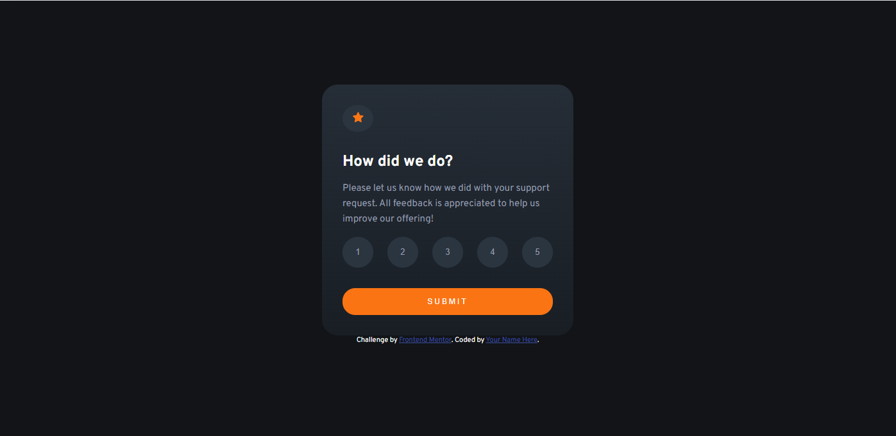
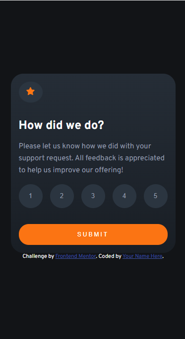

# Frontend Mentor - Interactive rating component solution

This is a solution to the [Interactive rating component challenge on Frontend Mentor](https://www.frontendmentor.io/challenges/interactive-rating-component-koxpeBUmI). Frontend Mentor challenges help you improve your coding skills by building realistic projects. 

## Table of contents

- [Overview](#Это мое решение челленджа от Frontend Mentor)
  - [The challenge](#Суть  челленджа состояла в том, чтобы сделать подобный компонент, а главное для меня - использовать  в своей работе JS)
  - [Screenshot](# )
- [My process](#Я впервые использовала JS при создании сайта и горжусь результатом)
  - [Built with](CSS, HTML, JS)
  - [What I learned](#Я научилась тому, как вызывать элементы при работе со скриптом, как менять их CSS-свойства с помощью функций и как полезно бывает обращаться к id элементов html)
  - [Continued development](#Планирую использовать JS во всех последующих проектах)
- [Author](#Nezhelskaya Darya)